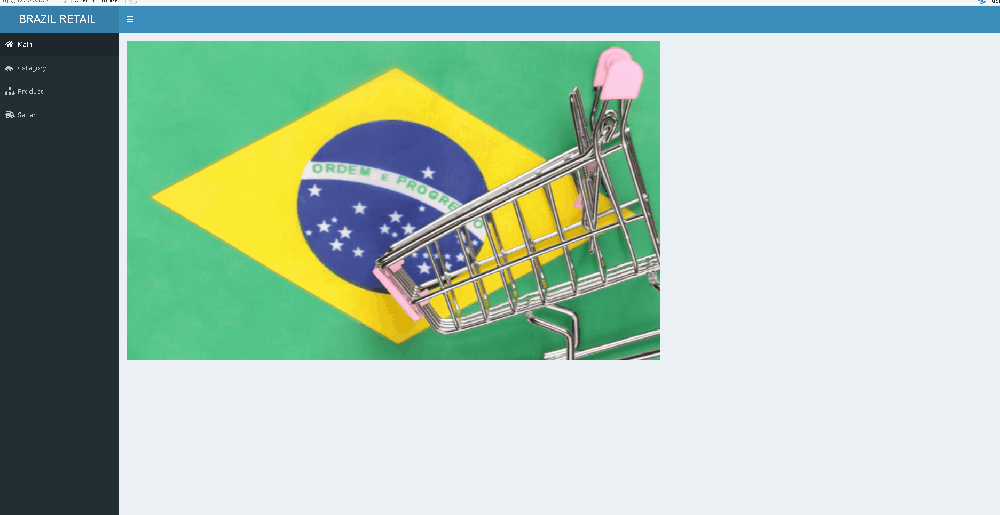

# Shiny App

I build a tiny shiny app that only focuses on Category level but with the same structure we can build a dashboard on any other level.
I used `plotly` for the plots and I added categories and periods filters!

