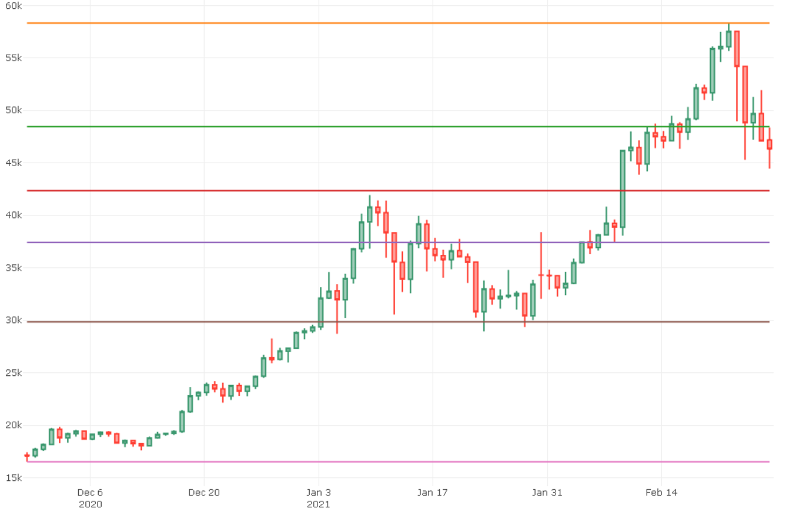

# Fibonacci Retracement Levels

Fibonacci retracement levels are horizontal lines that indicate where support and resistance are likely to occur. They stem from Fibonacci’s sequence, a mathematical formula that originated in the 13th century.

Each level is associated with a percentage. The percentage is how much of a prior move the price has retraced. The Fibonacci retracement levels are 23.6%, 38.2%, 61.8%, and 78.6%. While not officially a Fibonacci ratio, 50% is also used. 

*Source:* Investopedia

At this script, we performed fibonacci retracement levels on the Bitcoin daily chart from 2020-11-28 to 2021-02-28

