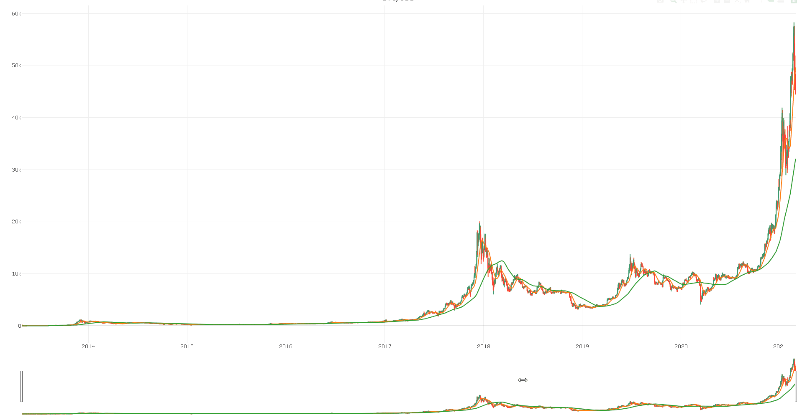

Cryptocurrencies Data can be found here:
https://www.kaggle.com/sudalairajkumar/cryptocurrencypricehistory

You can find a lot of crypto data on kaggle, with resolution as deep as 1-minute!


 
At this script we will impliment some Moving Averages on Bitcoin


```
library(data.table)
btc <- fread("C:/Users/user/Desktop/Andreas/R/kaggle/crypto_daily/coin_Bitcoin.csv")
btc[,setdiff(names(btc), names(btc)[1:3]), with = FALSE]
```
Date|High|Low|Open|Close|Volume|Marketcap
-|-|-|-|-|-|-
2013-04-29 23:59:59|   147.488|   134.0000|   134.444|   144.54|            0|   1603768865
2013-04-30 23:59:59|   146.930|   134.0500 |  144.000|   139.00 |           0 |  1542813125
2013-05-01 23:59:59|  139.890 |  107.7200 |  139.000 |  116.99  |          0  | 1298954594
2013-05-02 23:59:59|   125.600|    92.2819|   116.380|   105.21 |           0 |  1168517495
2013-05-03 23:59:59|   108.128|    79.1000 |  106.250|    97.75 |           0 |  1085995169
...            |  ...            |  ...          |   ...      |    ...      |...| ...       
2021-02-23 23:59:59| 54204.930| 45290.5903| 54204.930| 48824.43| 106102492824| 909925854460
2021-02-24 23:59:59| 51290.137| 47213.4982| 48835.088| 49705.33|  63695521388| 926393090751
2021-02-25 23:59:59| 51948.967| 47093.8530| 49709.082| 47093.85|  54506565949| 877766126138
2021-02-26 23:59:59| 48370.785| 44454.8421| 47180.464| 46339.76| 350967941479| 863752275053
2021-02-27 23:59:59| 48253.270| 45269.0258| 46344.772| 46188.45|  45910946382| 860978135421


```
btc[,names(btc)[1:3] := NULL]
btc <- btc[order(-Date)]
btc[,x := Close]
btc[,`:=`(
    sma_20 = RDataScience::simple_moving_avg(btc, 20),      # 20 days simple moving average
    sma_100 = RDataScience::simple_moving_avg(btc, 100)     # 100 days
)][,x:= NULL]

btc
```

Date   |   High|        Low |     Open |   Close    |   Volume |   Marketcap |  sma_20 | sma_100
-|-|-|-|-|-|-|-|-
2021-02-27 23:59:59| 48253.270| 45269.0258| 46344.772| 46188.45|  45910946382| 860978135421| 49584.66| 32121.58
2021-02-26 23:59:59| 48370.785| 44454.8421| 47180.464| 46339.76| 350967941479| 863752275053| 49220.41| 31837.87
2021-02-25 23:59:59| 51948.967| 47093.8530| 49709.082| 47093.85|  54506565949| 877766126138| 48866.72| 31552.51
2021-02-24 23:59:59| 51290.137| 47213.4982| 48835.088| 49705.33|  63695521388| 926393090751| 48419.25| 31258.02
2021-02-23 23:59:59| 54204.930| 45290.5903| 54204.930| 48824.43| 106102492824| 909925854460| 47780.28| 30928.13
...                   |    ...      | ...          |    ...      |    ...     |...|...|...| ...      
2013-05-03 23:59:59|   108.128|    79.1000|   106.250|    97.75|            0|   1085995169|     0.00|     0.00
2013-05-02 23:59:59|   125.600|    92.2819|   116.380|   105.21|            0|   1168517495|     0.00|     0.00
2013-05-01 23:59:59|   139.890|   107.7200|   139.000|   116.99|            0|   1298954594|     0.00|     0.00
2013-04-30 23:59:59|   146.930|   134.0500|   144.000|   139.00|            0|   1542813125|     0.00|     0.00
2013-04-29 23:59:59|   147.488|   134.0000|   134.444|   144.54|            0|   1603768865|     0.00|     0.00


